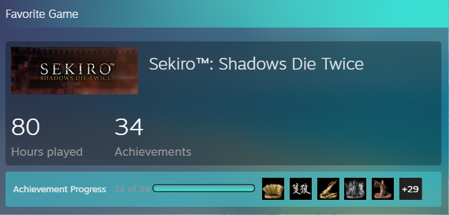
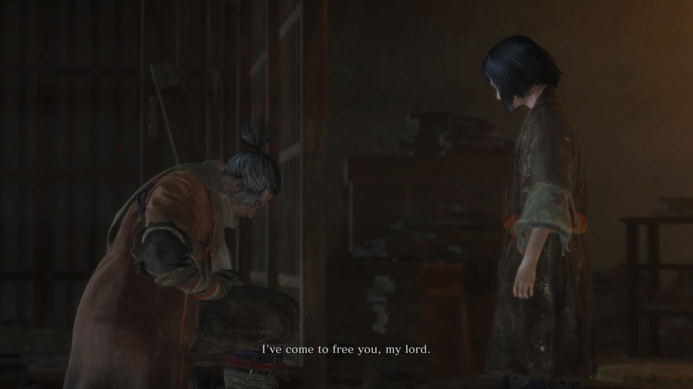
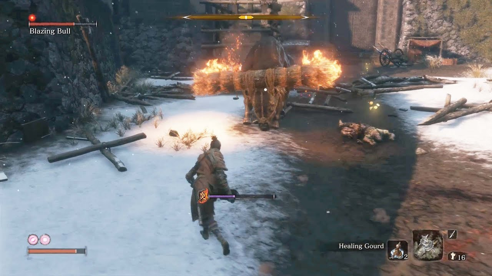

# Sekiro: The Pursuit of Perfection

Sekiro: Shadows Die Twice was the Game of The Year in 2019 developed by FromSoftware Studios. If you know about souls-like games, this title is one of the hardest of the genre. The mechanics of the game that is simple to learn but hard to master is what makes it worth it in the end.

And I happen to pick-up this game in early this year as a challenge to myself because I saw some random videos demonstrating the sheer skill and mechanics needed to beat this game. It was cool. 80 hours in and I have completed the game. All achievements and all challenges done. It was a test of character and my progression from hour 1 to hour 80, simply enjoyable.

# Easy to learn, difficult to master

The game is centered around perfect timing and well-time dodges. You can either block, dodge and parry. Parry will benefit you most. 

You block too much and you fall and risk exposing yourself to the enemy. 

You parry well and your enemy will expose themselves. See the sparks? Yeah, that's a parry. When you parry enough, you can execute your enemies with 1 swift motion like so..

***The block, parry and execution***

# Sekiro's Charm

The setting of the game is in fiction-like ancient era of Japan somewhere in a place called Ashina. You are playing as Sekiro, serving Master Kuro to fulfill his destiny and bearing your responsibility as the bearer of the Dragon's Blood. Lore-wise, you are immortal and cannot die as you swore your oath to protect your Lord. Spoiler-alert, the rulers of Ashina, are dying to claim the power, to become immortal.

***Sekiro and Master Kuro***

Compared to other Souls-like games, the main focus of Sekiro is always facing up to your enemy, read their attacks and be reactive as oppose to dodging. Once you get into the rhythm of parrying and deflecting, you're unstoppable. The bad news is, you have to get good. To be excellent at something, you must be bad at the start. That's the hard truth I learned while playing this game. It's very frustrating at first but looking back, oh how much I've grown playing this game and beating it entirely. The feeling is just satisfying. 

# Boss Fights & My Growth

Spoiler-alert! When starting out the game, the game just gives you basic controls and it throws you the most hardest boss of the game after a few cutscenes. He is known as Genichiro Ashina. He's the current Prince of Ashina and desired the power of immortality. 

Starting out, the fight is impossible for you. You are destined to lose the fight no matter what. And the developers behind this game makes a bold statement of it. It is a huge middle-finger to the player, basically they are saying "You Suck" at the start. And indeed it is a humbling experience.

***Genichiro Ashina***

After your scripted loss, you are thrown back to the pits and you work your way up from the depths of Ashina. And from there finally, the game starts for you. From small enemies, to bigger ones. You will fight brutes, animals, and skilled swordsmen in your way.

***A sneak peek of the blazingly hot battle!***

As you fight your way through Ashina Castle, at the peak once again you meet him. Genichiro Ashina once again. Will you succumb to his skills like you started or have you grown as a person, as a player in your journey?

***The battle at the top of the Ashina Castle***

Initially, I struggled alot at fighting him. I was spamming block my way most of the fights leading to him and even [cheesing](https://www.ecigames.net/media/game-terminology-explained-cheesing) the fights. In a sense, it's quite unfair and kind of cheating. I got heavily punished for that when fighting Genichiro.

The Genichiro fight was testing me on my fundamentals of the game. Blocking, parrying and reading the attacks. Honestly speaking, I did not master any of them. I just prayed it blocked and boy it was an uphill battle. I struggled with him for almost 3 days. I even took a break to clear my mind of any mindblock for the fight.
